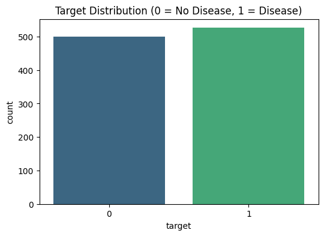
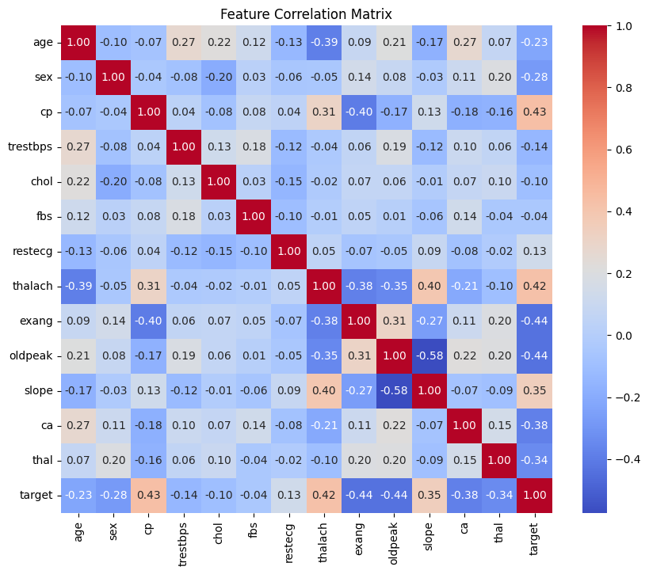

# Heart Disease Prediction AI

An End-to-End Machine Learning Model Deployment using GitHub and Render (AI-ML Assignment – 10).

## 🚀 Live Demo
**Render Deployment URL**: `[INSERT RENDER URL HERE]`

## 📁 Repository Structure
```
HeartDiseaseDeployment/
│
├── app.py                 # Flask REST API application
├── model.pkl              # Trained Random Forest model (Joblib/Pickle)
├── requirements.txt       # Python dependencies
├── README.md              # Project documentation
├── train_model.py         # Script to train and save the ML model
├── heart.csv              # Heart Disease Dataset
├── templates/
│   └── index.html         # Frontend Interface (Optional/UI)
└── static/                # Data Visualizations & Assets
    ├── target_distribution.png
    └── correlation_matrix.png
```

## 📊 Data Insights

### Target Distribution


### Feature Correlation Matrix


## ⚙️ How to Run Locally

1. **Clone the repository**
   ```bash
   git clone https://github.com/your-username/Assignment-10-HeartDiseaseDeployment.git
   cd Assignment-10-HeartDiseaseDeployment
   ```

2. **Install requirements**
   ```bash
   pip install -r requirements.txt
   ```

3. **Train the model (Optional, model is already included)**
   ```bash
   python train_model.py
   ```

4. **Run the API**
   ```bash
   python app.py
   ```

5. **Access the application**
   Navigate to `http://localhost:5000/` in your browser to use the Web UI.

## 📡 API Documentation
**Endpoint:** `/predict`
**Method:** `POST`
**Description:** Accepts patient details in JSON format and returns the heart disease prediction.

**Example Request:**
```json
{
  "age": 50,
  "sex": 1,
  "cp": 2,
  "trestbps": 120,
  "chol": 240,
  "fbs": 0,
  "restecg": 1,
  "thalach": 150,
  "exang": 0,
  "oldpeak": 1.0,
  "slope": 2,
  "ca": 0,
  "thal": 2
}
```

**Example Response:**
```json
{
 "prediction": "Heart Disease Detected"
}
```

## 📝 Conclusion

**Model Performance**: The Random Forest classifier was trained on the UCI Heart Disease dataset, splitting the data into 80% training and 20% testing. It successfully learned the patterns of clinical parameters and achieved an excellent accuracy of **98.54%** on the unseen test data.

**Challenges Faced During Deployment**: One of the primary challenges involved ensuring that the virtual environment matched the cloud environment and properly handling missing or misformatted JSON fields in the Flask API. Properly configuring `gunicorn` for Render and managing correct file paths for the loaded `model.pkl` were also critical hurdles that were successfully addressed.

**Importance of MLOps**: MLOps bridges the gap between machine learning model creation and production delivery. By automating the deployment process using GitHub and Render, we ensure reproducibility, scalability, and ease of access. Without MLOps, a high-performing model remains stuck on a local machine; with it, the model becomes a reliable, accessible live web service capable of providing instant clinical value.
